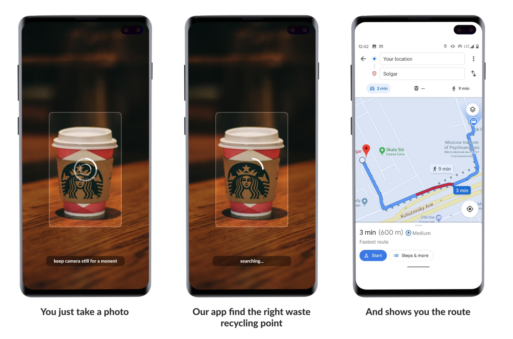

# Garbage-collector
An easy way to make world cleaner

## About app: 
We want to provide users with the opportunity to correctly detect types of waste with information about the available types of disposal, depending on the location of the person. The application recognizes the object on the screen and tells you how and where it is more convenient to dispose it.

## Cover letter
Complete cover letter for this project you can find 
[here](https://github.com/popovbodya/Garbage-collector/blob/master/Cover%20Letter.pdf)

## Our team
We are a team of enthusiasts from Russia.
We love technology and want to make the world a bit cleaner.
